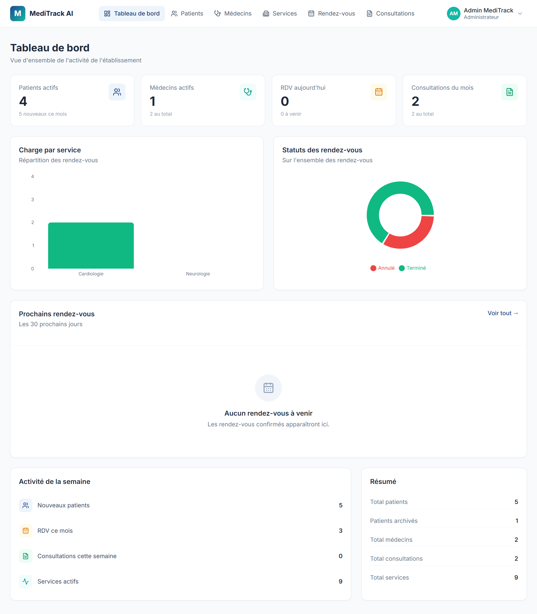
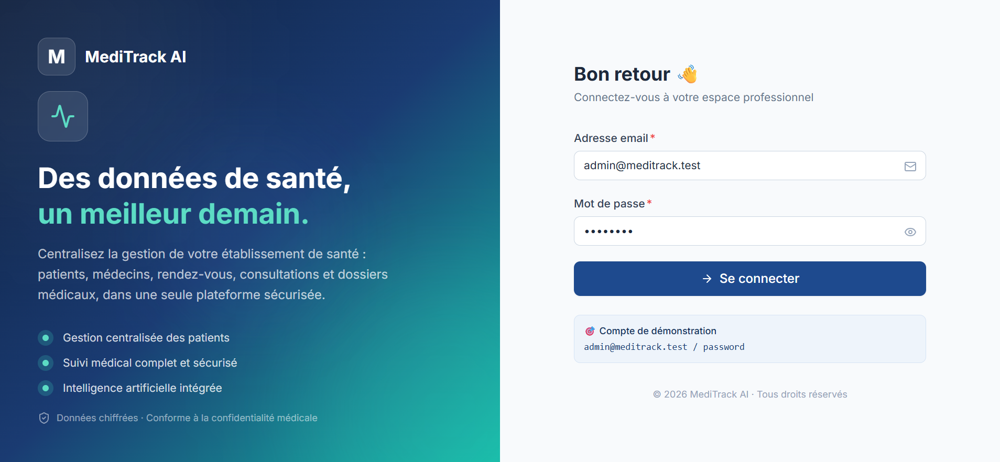
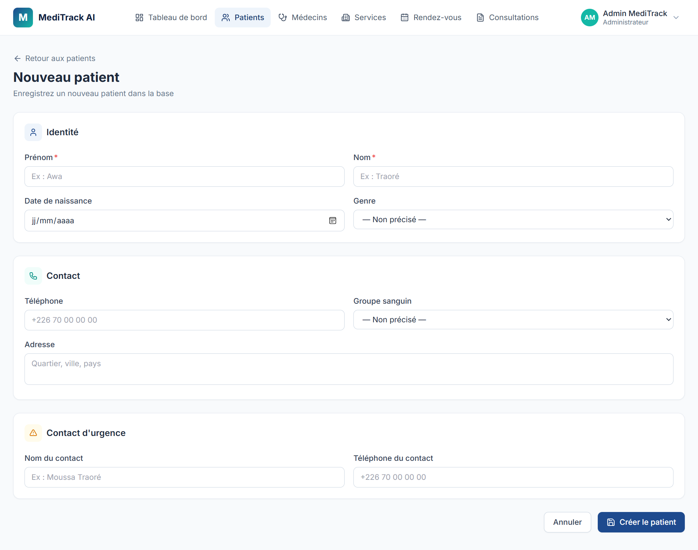
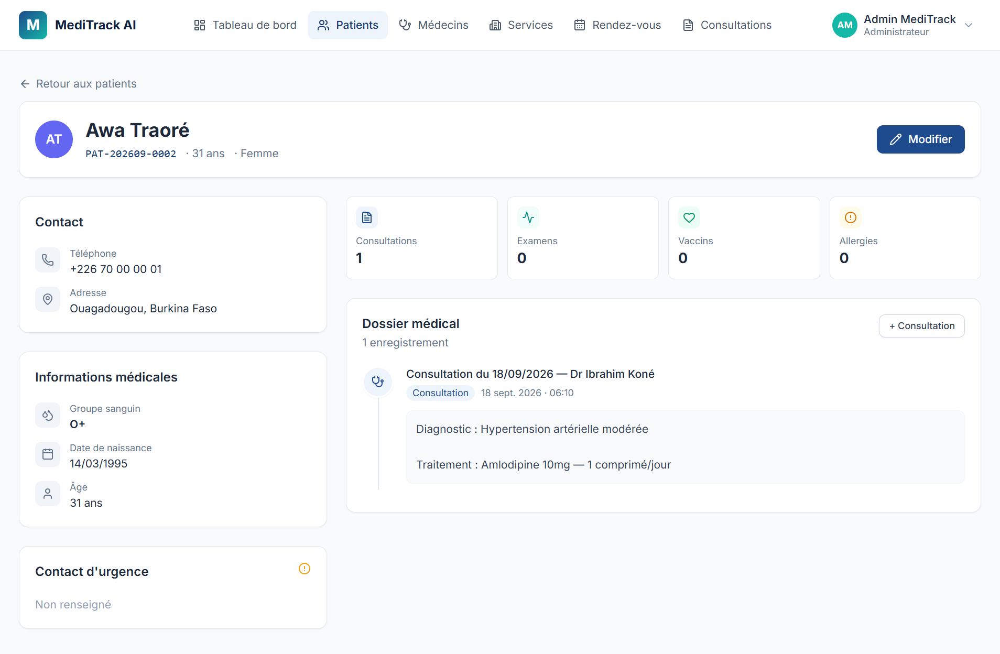
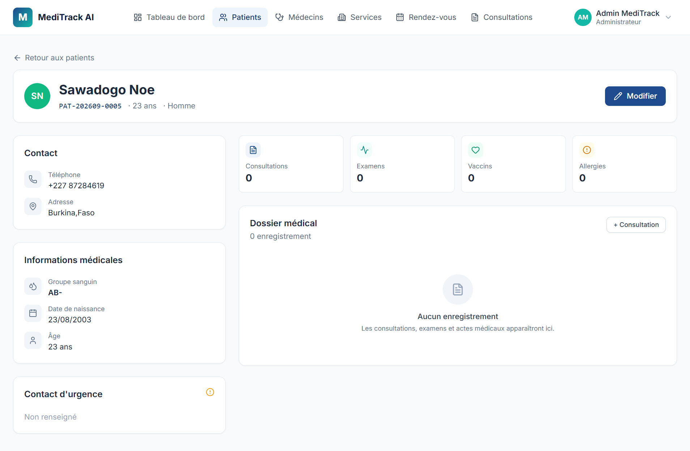
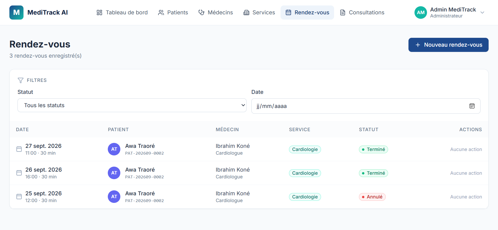
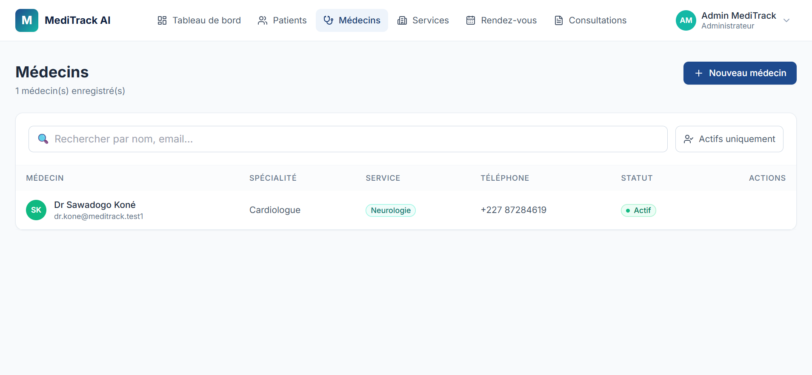
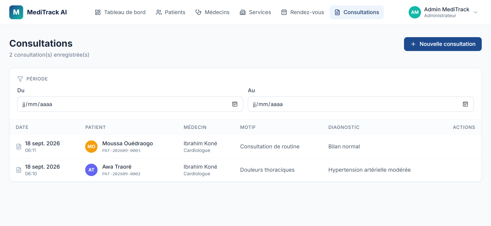

# MediTrack AI

> **« Des données de santé, un meilleur demain. »**

Plateforme intelligente de gestion des établissements de santé : centralisation des patients, médecins, rendez-vous, consultations et dossiers médicaux, avec préparation d'une couche d'intelligence artificielle d'aide à la décision.

---

## 📋 Sommaire

- [À propos](#-à-propos)
- [Fonctionnalités](#-fonctionnalités)
- [Captures d'écran](#-captures-décran)
- [Stack technique](#-stack-technique)
- [Architecture](#-architecture)
- [Structure du projet](#-structure-du-projet)
- [Installation](#-installation)
- [API](#-api)
- [Roadmap](#-roadmap)
- [Auteur](#-auteur)

---

## 🎯 À propos

MediTrack AI est né du constat que de nombreux établissements de santé gèrent encore leurs informations (patients, rendez-vous, consultations) de manière dispersée ou manuelle. Cela entraîne des pertes de temps, des doublons, et une faible exploitation des données disponibles.

Cette plateforme répond à cette problématique en proposant :

- Une **centralisation** des données médicales et administratives
- Une **gestion fine des rôles** (Administrateur, Médecin, Secrétaire, Patient)
- Une **API REST sécurisée** préparant une future application mobile
- Un socle **prêt à accueillir de l'intelligence artificielle** (analyse, alertes, aide à la décision)

---

## ✨ Fonctionnalités

### 🔐 Authentification & sécurité
- Authentification par token (Laravel Sanctum)
- Gestion des rôles et permissions
- Mots de passe hashés (Bcrypt)
- Journalisation des actions sensibles

### 👥 Gestion des patients
- Enregistrement, modification, archivage (jamais de suppression physique)
- **Code patient auto-généré** au format `PAT-YYYYMM-0001`
- Recherche multi-champs (nom, code, téléphone)
- Dossier médical complet avec historique chronologique

### 🩺 Gestion médicale
- **Médecins** : compte utilisateur + profil professionnel liés en une transaction
- **Services** : médecine générale, pédiatrie, maternité, cardiologie, laboratoire, radiologie
- **Rendez-vous** :
  - Détection automatique des chevauchements (médecin / patient)
  - Workflow de statuts strict : `pending → confirmed → completed`
  - Filtres par date, statut, médecin, service
- **Consultations** :
  - Enregistrement du motif, observations, diagnostic et traitement
  - **Génération automatique d'une entrée dans le dossier médical du patient**
  - Le rendez-vous lié passe automatiquement au statut `completed`

### 📊 Tableau de bord
- Statistiques en temps réel (patients, médecins, RDV, consultations)
- Graphique de charge par service (ratio RDV / médecin)
- Répartition des statuts de rendez-vous
- Liste des prochains rendez-vous

---

## 📸 Captures d'écran

### Connexion

### Tableau de bord

### Liste des patients

### Dossier médical d'un patient

### Formulaire patient

### Prise de rendez-vous

### Gestion des médecins

### Consultations

---

## 🛠️ Stack technique

| Couche | Technologie |
|---|---|
| **Frontend** | React 19 · TypeScript · Vite · Tailwind CSS · React Router · Zustand · Recharts · Lucide Icons |
| **Backend** | Laravel 13 · PHP 8.3 · Laravel Sanctum · Eloquent ORM |
| **Base de données** | MySQL 8 |
| **IA (prévu)** | Python · Pandas · Scikit-learn · PyTorch |
| **Outils** | VS Code · Git / GitHub · Postman · draw.io · Laragon |

---

## 🏗️ Architecture
L'application est organisée en trois couches indépendantes qui communiquent via une API REST.

**Frontend (React + TypeScript)** → **API REST (Laravel)** → **MySQL**

Et en parallèle, un service Python viendra s'ajouter pour la couche IA.

| Couche | Technologie | Rôle |
|---|---|---|
| **Frontend** | React + TypeScript + Vite | Interface utilisateur |
| **API REST** | Laravel 13 + Sanctum | Logique métier + authentification |
| **Base de données** | MySQL 8 | Persistance des données |
| **Service IA** | Python + FastAPI (prévu) | Analyse et aide à la décision |

Le frontend consomme uniquement l'API REST, ce qui permet d'envisager facilement une application mobile (React Native) qui réutiliserait les mêmes endpoints.