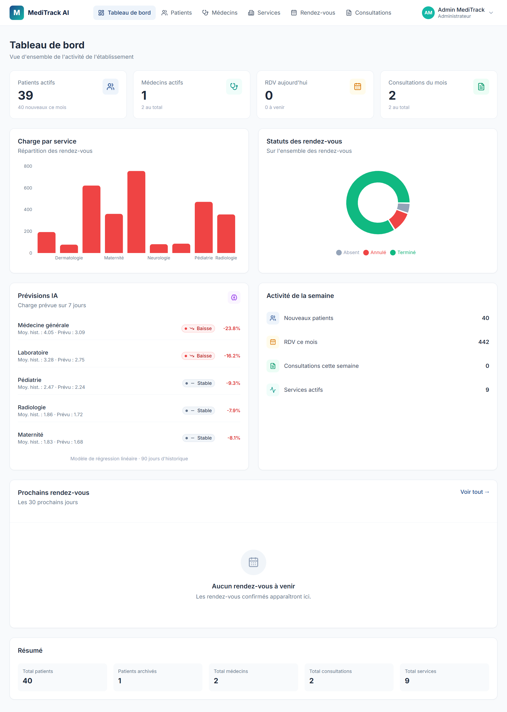

<div align="center">

# 🏥 MediTrack AI

### *« Des données de santé, un meilleur demain. »*

Plateforme intelligente de gestion des établissements de santé : centralisation des patients, médecins, rendez-vous, consultations et dossiers médicaux, avec un module d'intelligence artificielle d'aide à la décision.

[](https://react.dev/)
[](https://www.typescriptlang.org/)
[](https://laravel.com/)
[](https://www.php.net/)
[](https://www.python.org/)
[](https://fastapi.tiangolo.com/)
[](https://www.mysql.com/)
[]()

</div>

<br>


<br>

## 📋 Sommaire

<table>
<tr>
<td valign="top">

- [🎯 À propos](#-à-propos)
- [✨ Fonctionnalités](#-fonctionnalités)
- [📸 Captures d'écran](#-captures-décran)
- [🛠️ Stack technique](#️-stack-technique)

</td>
<td valign="top">

- [🏗️ Architecture](#️-architecture)
- [🤖 Modèle d'IA](#-modèle-dia)
- [📁 Structure du projet](#-structure-du-projet)
- [🚀 Installation](#-installation)

</td>
<td valign="top">

- [🔌 API](#-api)
- [🗺️ Roadmap](#️-roadmap)
- [👤 Auteur](#-auteur)

</td>
</tr>
</table>

<br>

---


---

## 🎯 À propos

MediTrack AI est né du constat que de nombreux établissements de santé gèrent encore leurs informations (patients, rendez-vous, consultations) de manière dispersée ou manuelle. Cela entraîne des pertes de temps, des doublons, et une faible exploitation des données disponibles.

Cette plateforme répond à cette problématique en proposant :

- Une centralisation des données médicales et administratives
- Une gestion fine des rôles (Administrateur, Médecin, Secrétaire, Patient)
- Une API REST sécurisée préparant une future application mobile
- Un module d'intelligence artificielle pour l'analyse et l'aide à la décision


---

## ✨ Fonctionnalités

### 🔐 Authentification & sécurité

- Authentification par token (Laravel Sanctum)
- Gestion des rôles et permissions
- Mots de passe hashés (Bcrypt)
- Journalisation des actions sensibles

### 👥 Gestion des patients

- Enregistrement, modification, archivage (jamais de suppression physique)
- Code patient auto-généré au format `PAT-YYYYMM-0001`
- Recherche multi-champs (nom, code, téléphone)
- Dossier médical complet avec historique chronologique

### 🩺 Gestion médicale

- **Médecins** : compte utilisateur + profil professionnel liés en une transaction
- **Services** : médecine générale, pédiatrie, maternité, cardiologie, laboratoire, radiologie
- **Rendez-vous** :
  - Détection automatique des chevauchements (médecin / patient)
  - Workflow de statuts strict : `pending` → `confirmed` → `completed`
  - Filtres par date, statut, médecin, service
- **Consultations** :
  - Enregistrement du motif, observations, diagnostic et traitement
  - Génération automatique d'une entrée dans le dossier médical du patient
  - Le rendez-vous lié passe automatiquement au statut `completed`

### 📊 Tableau de bord

- Statistiques en temps réel (patients, médecins, RDV, consultations)
- Graphique de charge par service (ratio RDV / médecin)
- Répartition des statuts de rendez-vous
- Liste des prochains rendez-vous

### 🧠 Intelligence artificielle

- Service Python indépendant (FastAPI + scikit-learn)
- Prévision de charge par service sur les 7 prochains jours
- Détection de tendances : hausse, baisse, stable
- Alertes automatiques quand un service est en tension
- Architecture découplée : React → Laravel → Service IA → MySQL


---

## 📸 Captures d'écran

<div align="center">

| Connexion | Tableau de bord |
|:---:|:---:|
|  |  |

| Liste des patients | Dossier médical |
|:---:|:---:|
|  |  |

| Formulaire patient | Rendez-vous |
|:---:|:---:|
|  |  |

| Médecins | Consultations |
|:---:|:---:|
|  |  |

| Prévisions IA |
|:---:|
|  |

</div>


---

## 🛠️ Stack technique

| Couche | Technologie |
|---|---|
| **Frontend** | React 19 · TypeScript · Vite · Tailwind CSS · React Router · Zustand · Recharts · Lucide Icons |
| **Backend** | Laravel 13 · PHP 8.3 · Laravel Sanctum · Eloquent ORM |
| **Base de données** | MySQL 8 |
| **Service IA** | Python 3.13 · FastAPI · scikit-learn · Pandas · SQLAlchemy |
| **Outils** | VS Code · Git / GitHub · Postman · draw.io · Laragon |


---

## 🏗️ Architecture

L'application est organisée en quatre couches indépendantes qui communiquent via HTTP.

| Couche | Technologie | Rôle |
|---|---|---|
| **Frontend** | React + TypeScript + Vite | Interface utilisateur |
| **API REST** | Laravel 13 + Sanctum | Logique métier + authentification |
| **Base de données** | MySQL 8 | Persistance des données |
| **Service IA** | Python 3.13 + FastAPI + scikit-learn | Prévisions et aide à la décision |

Le frontend ne parle qu'à l'API Laravel. Laravel fait le pont vers le service IA Python via HTTP (proxy sécurisé). Le service IA lit directement la base MySQL en lecture seule pour ses analyses.


---

## 🤖 Modèle d'IA

Le service Python entraîne un modèle de régression linéaire par service sur l'historique des rendez-vous. Il prédit la charge des 7 prochains jours et détecte les tendances (hausse / baisse / stable).

> Choix volontaire d'un modèle simple et interprétable plutôt qu'un réseau de neurones opaque : pour un premier module d'IA en santé, la clarté prime sur la performance brute.


---

## 📁 Structure du projet

```
meditrack-ai/
├── backend/
├── frontend/
├── ai-service/
└── docs/
```

- `backend/` : API Laravel (contrôleurs, modèles, migrations, seeders, service HTTP vers Python)
- `frontend/` : Application React (composants, pages, design system, store Zustand)
- `ai-service/` : Service Python (FastAPI, modèles ML, scripts)
- `docs/` : Captures d'écran et documentation


---

## 🚀 Installation

### Prérequis

- PHP 8.3+
- Composer
- Node.js 20+
- Python 3.11+
- MySQL 8

### 1. Cloner le dépôt

```bash
git clone https://github.com/Sawadogo-cmk/meditrack-ai.git
cd meditrack-ai
```

### 2. Backend (Laravel)

```bash
cd backend
composer install
cp .env.example .env
php artisan key:generate
```

Configure la base de données dans `.env` :

```env
DB_CONNECTION=mysql
DB_HOST=127.0.0.1
DB_PORT=3306
DB_DATABASE=meditrack_ai
DB_USERNAME=root
DB_PASSWORD=

AI_SERVICE_URL=http://localhost:8001
```

Crée la base de données dans MySQL :

```sql
CREATE DATABASE meditrack_ai CHARACTER SET utf8mb4 COLLATE utf8mb4_unicode_ci;
```

Puis lance :

```bash
php artisan migrate --seed
php artisan serve
```

L'API est disponible sur `http://localhost:8000`.

**Compte par défaut :**
- Email : `admin@meditrack.test`
- Mot de passe : `password`

### 3. Frontend (React)

Dans un second terminal :

```bash
cd frontend
npm install
```

Crée le fichier `frontend/.env` :

```env
VITE_API_URL=http://localhost:8000/api
```

Puis :

```bash
npm run dev
```

L'application est disponible sur `http://localhost:5173`.

### 4. Service IA (Python)

Dans un troisième terminal :

```bash
cd ai-service
python -m venv .venv
.\.venv\Scripts\Activate.ps1
pip install -r requirements.txt
```

Crée le fichier `ai-service/.env` :

```env
DB_HOST=127.0.0.1
DB_PORT=3306
DB_DATABASE=meditrack_ai
DB_USERNAME=root
DB_PASSWORD=
```

Puis lance :

```bash
uvicorn main:app --reload --port 8001
```

Le service est disponible sur `http://localhost:8001`.

Documentation interactive : `http://localhost:8001/docs`.


---

## 🔌 API

### Authentification

| Méthode | Endpoint | Description |
|---|---|---|
| POST | `/api/auth/login` | Connexion |
| POST | `/api/auth/logout` | Déconnexion |
| GET | `/api/auth/me` | Utilisateur connecté |

### Ressources

| Méthode | Endpoint | Description |
|---|---|---|
| GET, POST | `/api/patients` | Liste / création |
| GET, PUT, DELETE | `/api/patients/{id}` | Détail / modification / archivage |
| GET | `/api/patients/{id}/medical-records` | Dossier médical du patient |
| GET, POST | `/api/doctors` | Liste / création |
| GET, PUT, DELETE | `/api/doctors/{id}` | Détail / modification / désactivation |
| GET, POST | `/api/services` | Liste / création |
| GET, POST | `/api/appointments` | Liste / création |
| PATCH | `/api/appointments/{id}/status` | Changement de statut |
| GET, POST | `/api/consultations` | Liste / création |
| GET | `/api/dashboard/stats` | Statistiques globales |

### Intelligence artificielle

| Méthode | Endpoint | Description |
|---|---|---|
| GET | `/api/ai/predictions` | Prévisions de charge par service |
| GET | `/api/ai/trends` | Tendances et alertes |

Toutes les routes protégées nécessitent :

```
Authorization: Bearer {token}
Accept: application/json
```

### Exemple d'appel

```bash
curl -X POST http://localhost:8000/api/auth/login \
  -H "Content-Type: application/json" \
  -H "Accept: application/json" \
  -d '{"email":"admin@meditrack.test","password":"password"}'
```


---

## 🗺️ Roadmap

- [x] Authentification et gestion des rôles
- [x] CRUD Patients avec archivage
- [x] CRUD Services médicaux
- [x] Gestion des Médecins (User + Doctor)
- [x] Rendez-vous avec détection de chevauchement
- [x] Consultations et dossier médical automatique
- [x] Tableau de bord avec graphiques
- [x] Design system complet (React + Tailwind)
- [x] Module d'intelligence artificielle (prévisions de charge)
- [ ] Application mobile (React Native)
- [ ] Notifications email / SMS
- [ ] Export PDF des dossiers médicaux
- [ ] Tests automatisés (PHPUnit + Vitest + Pytest)
- [ ] Documentation API interactive (Scramble pour Laravel)


---

## 👤 Auteur

**Sawadogo Noé**

- GitHub : [@Sawadogo-cmk](https://github.com/Sawadogo-cmk)
- Projet : MediTrack AI — Développement full-stack + IA


---

## 📄 Licence

Projet privé — Tous droits réservés.

*Réalisé dans le cadre d'un projet personnel de formation et de préparation professionnelle.*
